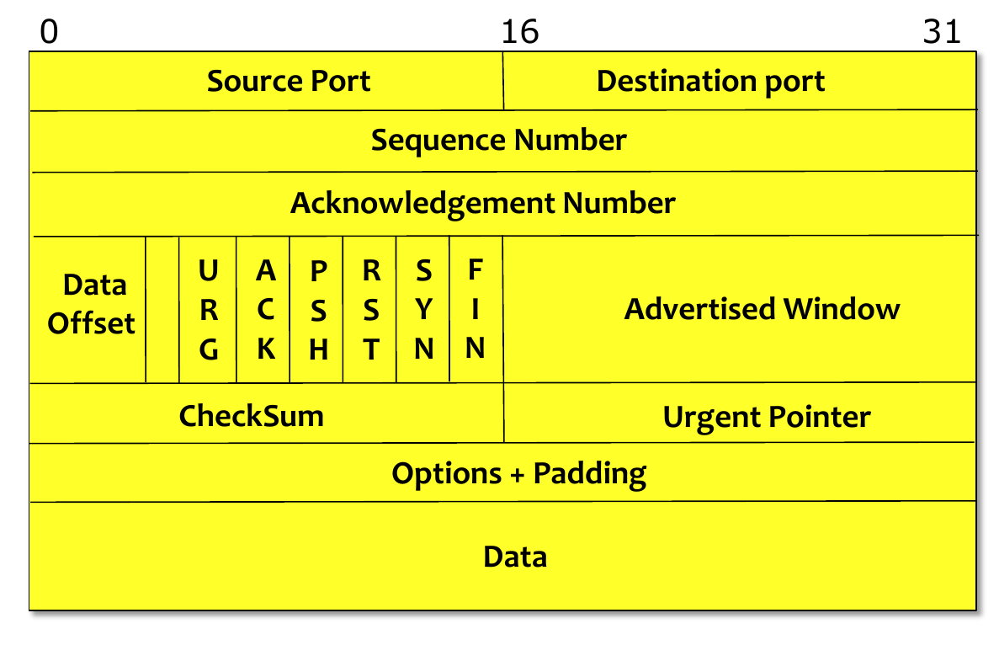
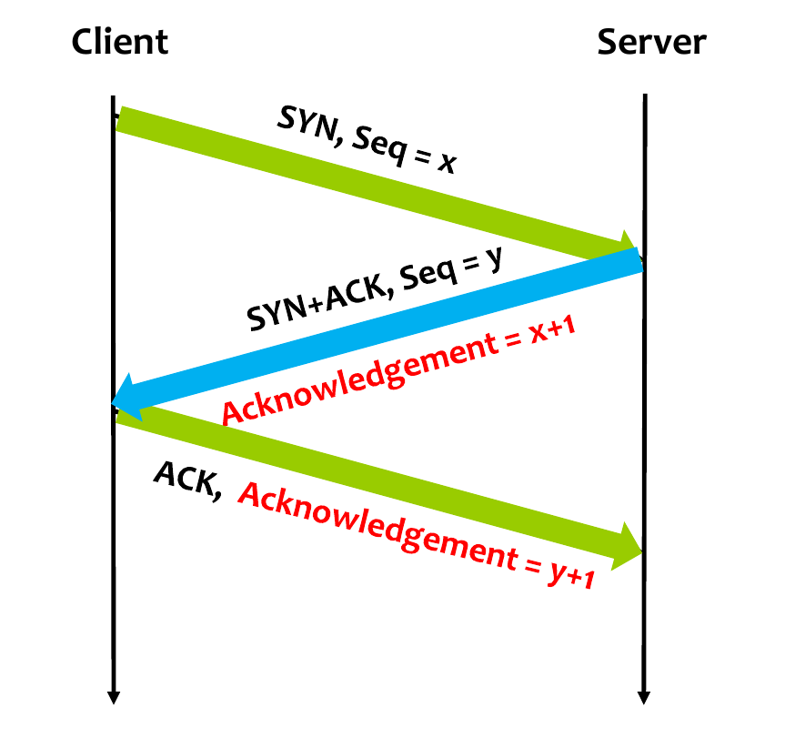
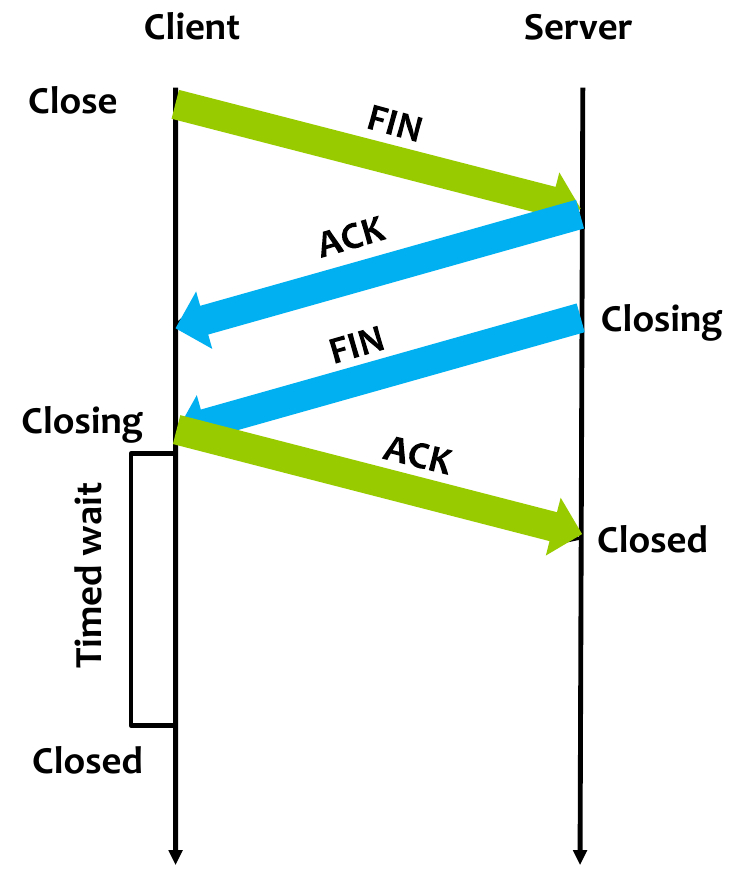
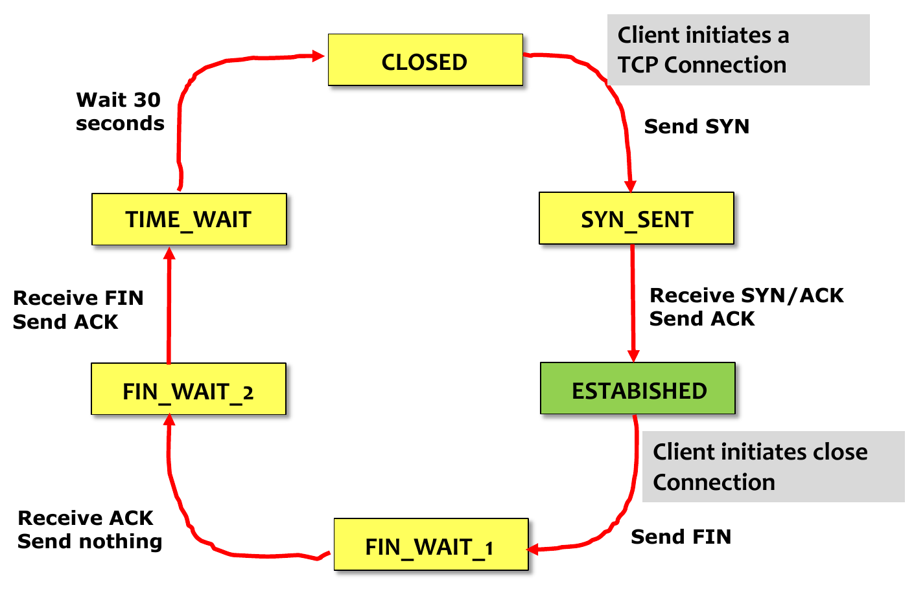
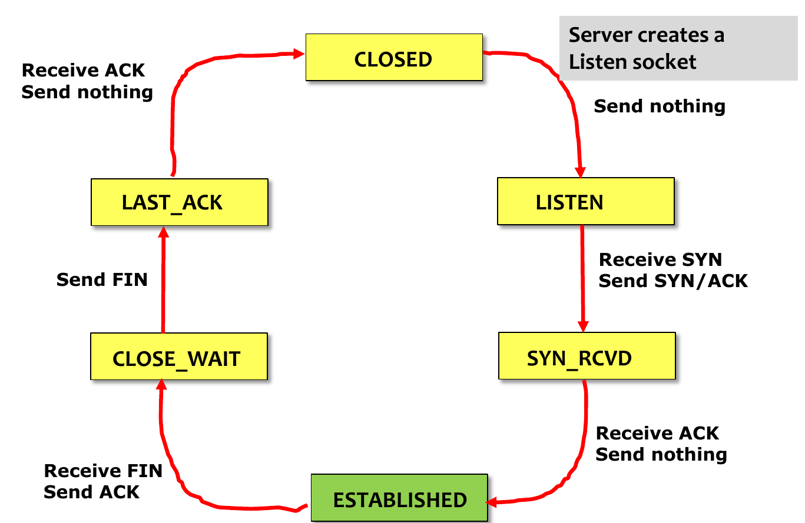
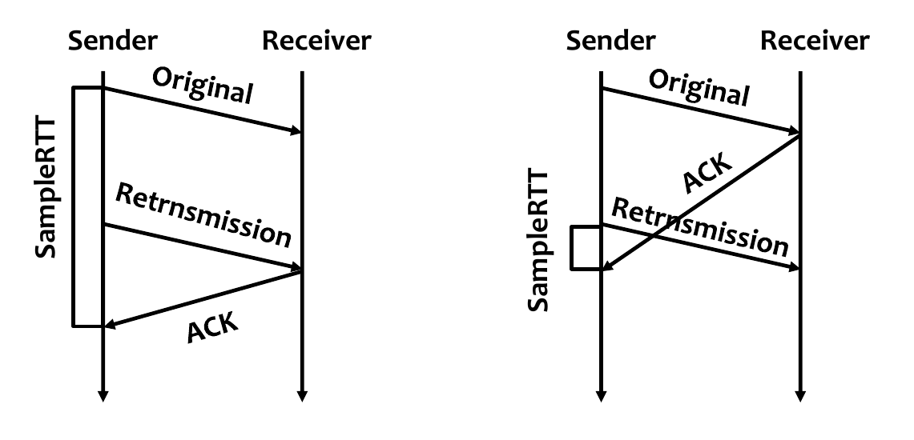
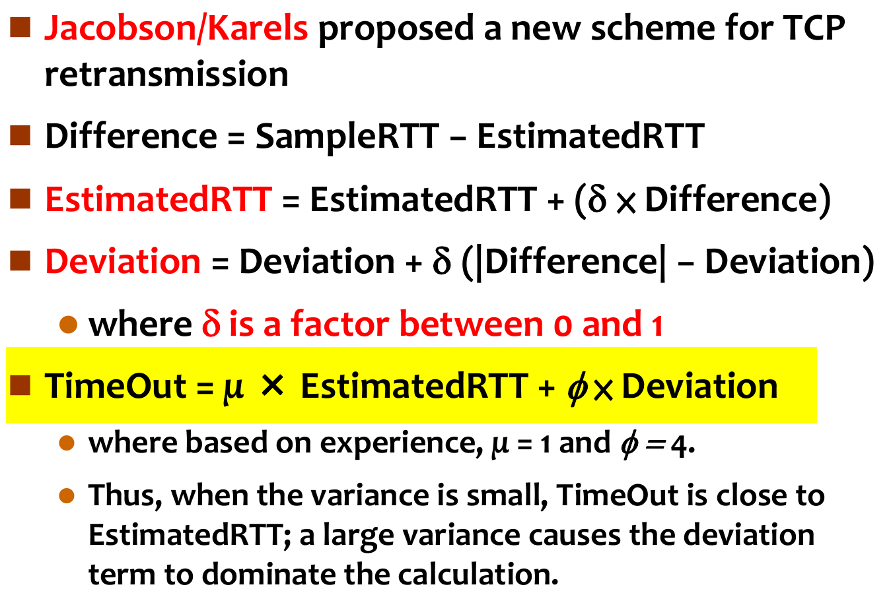
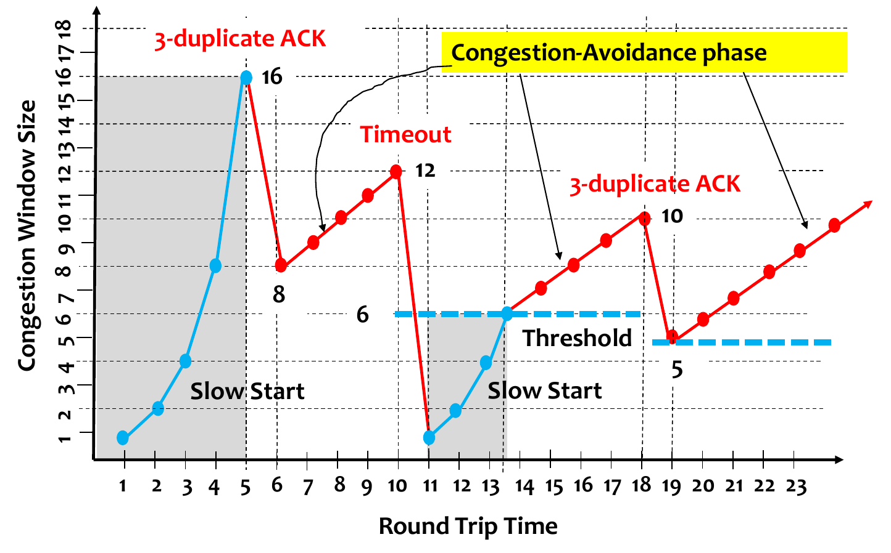

## TCP

---

TCP特点：

 + 进程到进程的通信
 + 字节流服务
 + 提供可靠的服务
 + 面向连接
 + 双向传输（双工）

一些名词解析：

`flow control`：流控制。由于通信的2台计算机之间的处理速度不同，缓存大小不同。所以接收方需要告知对方现在还能送多少的数据量来避免自己的缓存溢出导致数据丢失。

`Congestion control`:拥塞控制。`TCP`协议会根据现在网络的拥塞情况来决定以多少的速度来传输。

`RTT`:一个封包传输到对方，收到对方回的`ACK`封包的时间。`TCP`每次传输的`RTT`时间差距可以能很大。

`sliding window `:滑动窗口。用来确定多少到多少编号的数据接收到了，多少到多少的未接收到，和计算对方现在能发送多少的量。

`TCP`面临的挑战：

- 每次`RTT`的时间可能差距很大。
- 由于是分组网络，封包到达目的主机的顺序可能不同。		
- 要做`flow control`
- 要做`Congestion control`
- 提供可靠的连接（`IP`协议是不可靠的）
- 进程到进程的通信

`TCP`头格式：

封包头各字段含义：

`Source Port`:源进程的端口

`Destination port`：目的进程的端口

`Sequence Number`:每一个`byte`都有一个`Sequence Number`,封包中的`Sequence Number`的值表示`Data`字段的第一个个`byte`的`Sequence Number`值。如果`Sequence Number`没有落在`sliding window `中，这个封包不会被接收（即丢弃）。

`Acknowledgement Number`:接收方回给发送方时会告诉对方我成功接收到了`Sequence Number`之前的数据。

`Data Offset`:

`URG`:设置为`1`表示当前封包内有一些紧急的资料(一些特殊控制的资料)，也就是说`Urgent Pointer`的值有意义

`ACK`:设置为`1`表示`Acknowledgement Number`字段的值有意义

`PSH`:设置为`1`表示立即将`buffer`的内容打包发送，对方接收到后也立即通知上层接收这个封包

`RST`:设置为`1`表示有一段要求强制断开这次连接

`SYN`:设置为`1`表示这个封包是要建立连线的

`FIN`：设置为`1`表示这个封包是要断开连线

`Urgent Pointer`:表示从`data`开始到`Urgent Pointer`之前的是一些紧急的资料，后面的才是数据

`Advertised Window`:表示对方最多能发多少量的数据，最大的值是`2^16-1`

`CheckSum`:校验和，覆盖了整个`TCP`首部和数据

`TCP`是基于字节流的，但并不会将一个字节封装进一个封包（除非你一定要它这么做）。`TCP`会缓存上层交给它的数据，当缓存到达一定量的时候再封装成一个封包进行发送。接收方也是如此，`TCP`接收到数据后并不会马上通知上层应用来将数据取走，而是当缓存到一定量的时候再通知上层。（可通过`PSH`标志来让他马上发或和通知上层）

连线建立（`TCP`3次握手）：

当两台计算机通过`TCP`建立连线，会建立一条虚拟的逻辑线路。物理上封包怎么走，还是由路由来决定。

`Client`:发送一个封包`SYN=1`，`Seq=x`；

`Server`:接收到`client`的封包，发送一个封包`SYN=1`，`Seq=y`,`ACK=1`，`Acknowledgement=x+1`;

`Client`:接收到`Server`返回的封包，回一个封包表示自己收到了`ACK=1`,`Acknowledgement=y+1`;

连线建立成功，由于通信的双向的（即任意一方都能发送数据），所以各有一个自己的`Seq`值；

连线关闭：

假设由`Client`发起关闭连线请求

​	`Client`:发送`FIN=1`的封包

​	`Server`:回一个`ACK`,然后再发一个`FIN`的封包

​	`Client`:收到`FIN`,回一个`ACK`,进入`Closing`状态。

​	`Server`:收到`ACK`,直接进入`Closed`状态。

`Client`进入`Closing`状态后会等待一个时间（一般是30秒），为了等一些还在网络上传输（由于网络的延迟）的封包。时间过后进入`Closed`状态。

`Closed`状态后再收到封包一律丢弃。

`Client`状态图：

`Server`:

​	

`TimeOut`：封包发送后经历`TimeOut`时间还没收到`ACK`，则认为这个封包掉了，重传这个封包，这值是动态计算的。

`EstRTT`:之前平均的`RTT`值。

`TimeOut`时间值的计算：

简单的做法：

​	`EstRTT=a*EstRTT+(1-a)*SampleRTT`.`SampleRTT`表示最近一次测量的`RTT`值。(`a`一般在`0.8-0.9`之间)

​	`TimeOut=2*EstRTT`

由于封包可能被重送，那么`SampleRTT`的值可能会计算错误，因为你无法确定现在收到的这个`ACK`是之前被认为掉了的封包的`ACK`，还是重送封包的`ACK`;

现在常用用的是算法是`Jacobson/Karels Algorithm`。

利用了`deviation`值来表示`RTT`偏差，如果`RTT`稳定，`Deviation`的值会很小，`EstimatedRTT`对`TimeOut`影响就大，如果不稳定`Deviation`值很大，`TimeOut`的值受`Deviation`影响也会很大。

还有一个`Karn/Partridge Algorithm`算法。

`Fast Retransmit`快速重送：

​	当发送方收到接收回的`ACK Number`出现3次相同时，则认为封包出现丢失，立即重传，不再等`TimeOut`。

​	接收方回的`ACK Number`表示在这个`ACK Number`之前的所有数据都成功接收，现在在等第`ACK Number`的数据。（接收方一样会把`ACK Number`之后的数据接收放入缓存，只要是在`sliding window`内的封包都收）

`TCP Sender Congestion Control`拥塞控制：(相对于我不是太重要，直接写做法吧)

​	`MSS(maximun segment size)`:封包最大能送多少个`bytes`

​	`CongestionWindow` ：表示能传多少的量(`n*MSS`)

`TCP`传输数据量：

一开始时为`Slow Start`，`CongestionWindowSize=1`，`Slow Start Threshold=65535`(实际中的值要看`TCP`的实现)；

每收到一个`ACK`，`cw++`,每过一个`RTT`，`cw*=2`;

当发生`3-duplicate ACK`（收到3次重复`ACK`）,`cw=CW/2`;

发生`TimeOut`,`cw=1,sst=sst/2`.

当`cw>=sst`时候进入拥塞避免算法。

拥塞避免时：

收到一个`ACK`,`cw=cw+1/cw`,过一个`RTT`,`cw=cw+1`;

不同的`TCP`实现用的初始值不同，做的优化也不同。比如`RFC5681`的`Fast Recovery`快速恢复算法，`Forward Acknowledgment（FACK）`算法等。

### [图片和参考资料来源](http://www.xuetangx.com/courses/NTHU/MOOC_01_004/2014_T2/info)

