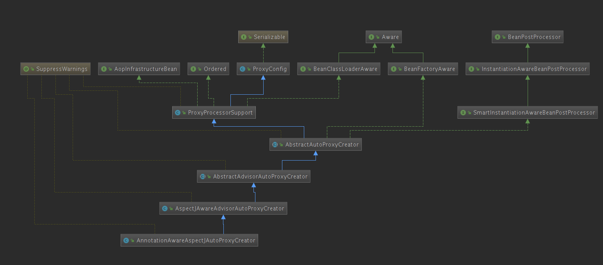
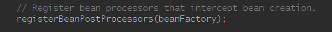
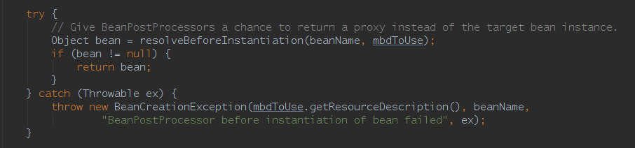

## 	AOP

---

5中通知方法的注解以及切入点注解和表达式：

```java
	//切入点注解
	@Pointcut("execution(* com.lx.animation.config.BeanClass.*(..))")
	public void cut(){}
    //目标类方法执行前执行该方法
    @Before(value="cut()")
    public void before(){
        System.out.println("目标类方法执行前执行该方法........");
    }

    @AfterReturning(value="cut()")
    public void afterReturn(){
        System.out.println("方法正常结束后执行该输出");
    }

    @After(value="cut()")
    public void after(){
        System.out.println("最终通知,方法无论是否发生异常,都会执行该输出");
    }

    @AfterThrowing(value="cut()", throwing="e")
    public void afterThrow(Exception e){
        System.out.println("如果方法执行发生异常,执行该输出"+e);
    }

    @Around(value="cut()")
    public Object around(ProceedingJoinPoint pjp){
        Object result=null;
        System.out.println("环绕通知---前置通知");
        return  result;
    }

```


`@EnableAspectJAutoProxy`启用`AOP`自动代理，注解中用`@Import`自动注册了`AspectJAutoProxyRegistrar`组件，源码如下

```java
@Target({ElementType.TYPE})
@Retention(RetentionPolicy.RUNTIME)
@Documented
@Import({AspectJAutoProxyRegistrar.class})
public @interface EnableAspectJAutoProxy {
    boolean proxyTargetClass() default false;

    boolean exposeProxy() default false;
}

```


`AnnotationAwareAspectJAutoProxyCreator`类继承图



其中值得关注部分是继承了`SmartInstantiationAwareBeanPostProcessor, BeanFactoryAware`接口

`SmartInstantiationAwareBeanPostProcessor`继承了后置处理器`InstantiationAwareBeanPostProcessor（继承了 BeanPostProcessor）`

在`refresh()`方法中有一个`registerBeanPostProcessors(beanFactory)`方法用于给容器中注册后置处理器。其中就包括了`AnnotationAwareAspectJAutoProxyCreator`。



`registerBeanPostProcessors`源码：

```java
public static void registerBeanPostProcessors(
			ConfigurableListableBeanFactory beanFactory, AbstractApplicationContext applicationContext) {

		String[] postProcessorNames = beanFactory.getBeanNamesForType(BeanPostProcessor.class, true, false);

		// Register BeanPostProcessorChecker that logs an info message when
		// a bean is created during BeanPostProcessor instantiation, i.e. when
		// a bean is not eligible for getting processed by all BeanPostProcessors.
		int beanProcessorTargetCount = beanFactory.getBeanPostProcessorCount() + 1 + postProcessorNames.length;
		beanFactory.addBeanPostProcessor(new BeanPostProcessorChecker(beanFactory, beanProcessorTargetCount));

		// Separate between BeanPostProcessors that implement PriorityOrdered,
		// Ordered, and the rest.
		List<BeanPostProcessor> priorityOrderedPostProcessors = new ArrayList<>();
		List<BeanPostProcessor> internalPostProcessors = new ArrayList<>();
		List<String> orderedPostProcessorNames = new ArrayList<>();
		List<String> nonOrderedPostProcessorNames = new ArrayList<>();
		for (String ppName : postProcessorNames) {
			if (beanFactory.isTypeMatch(ppName, PriorityOrdered.class)) {
				BeanPostProcessor pp = beanFactory.getBean(ppName, BeanPostProcessor.class);
				priorityOrderedPostProcessors.add(pp);
				if (pp instanceof MergedBeanDefinitionPostProcessor) {
					internalPostProcessors.add(pp);
				}
			}
			else if (beanFactory.isTypeMatch(ppName, Ordered.class)) {
				orderedPostProcessorNames.add(ppName);
			}
			else {
				nonOrderedPostProcessorNames.add(ppName);
			}
		}

		// First, register the BeanPostProcessors that implement PriorityOrdered.
		sortPostProcessors(priorityOrderedPostProcessors, beanFactory);
		registerBeanPostProcessors(beanFactory, priorityOrderedPostProcessors);

		// Next, register the BeanPostProcessors that implement Ordered.
		List<BeanPostProcessor> orderedPostProcessors = new ArrayList<>();
		for (String ppName : orderedPostProcessorNames) {
			BeanPostProcessor pp = beanFactory.getBean(ppName, BeanPostProcessor.class);
			orderedPostProcessors.add(pp);
			if (pp instanceof MergedBeanDefinitionPostProcessor) {
				internalPostProcessors.add(pp);
			}
		}
		sortPostProcessors(orderedPostProcessors, beanFactory);
		registerBeanPostProcessors(beanFactory, orderedPostProcessors);

		// Now, register all regular BeanPostProcessors.
		List<BeanPostProcessor> nonOrderedPostProcessors = new ArrayList<>();
		for (String ppName : nonOrderedPostProcessorNames) {
			BeanPostProcessor pp = beanFactory.getBean(ppName, BeanPostProcessor.class);
			nonOrderedPostProcessors.add(pp);
			if (pp instanceof MergedBeanDefinitionPostProcessor) {
				internalPostProcessors.add(pp);
			}
		}
		registerBeanPostProcessors(beanFactory, nonOrderedPostProcessors);

		// Finally, re-register all internal BeanPostProcessors.
		sortPostProcessors(internalPostProcessors, beanFactory);
		registerBeanPostProcessors(beanFactory, internalPostProcessors);

		// Re-register post-processor for detecting inner beans as ApplicationListeners,
		// moving it to the end of the processor chain (for picking up proxies etc).
		beanFactory.addBeanPostProcessor(new ApplicationListenerDetector(applicationContext));
	}
```

`AnnotationAwareAspectJAutoProxyCreator`类继承了`ordered`接口，注册代码如下：

```java
	// Next, register the BeanPostProcessors that implement Ordered.
		List<BeanPostProcessor> orderedPostProcessors = new ArrayList<>();
		for (String ppName : orderedPostProcessorNames) {
			BeanPostProcessor pp = beanFactory.getBean(ppName, BeanPostProcessor.class);
			orderedPostProcessors.add(pp);
			if (pp instanceof MergedBeanDefinitionPostProcessor) {
				internalPostProcessors.add(pp);
			}
		}
		sortPostProcessors(orderedPostProcessors, beanFactory);
		registerBeanPostProcessors(beanFactory, orderedPostProcessors);

```

之后调用`beanFactory.getBean(ppName, BeanPostProcessor.class)`,之后的流程与之前`IOC`中写的`getBean`流程一致。之后调用`registerBeanPostProcessors()->beanFactory.addBeanPostProcessor(postProcessor)`将`AnnotationAwareAspectJAutoProxyCreator`加入到`beanFactory.beanPostProcessors`数组中。

```java
private static void registerBeanPostProcessors(
			ConfigurableListableBeanFactory beanFactory, List<BeanPostProcessor> postProcessors) {

		for (BeanPostProcessor postProcessor : postProcessors) {
			beanFactory.addBeanPostProcessor(postProcessor);
		}
	}
	
	@Override
	public void addBeanPostProcessor(BeanPostProcessor beanPostProcessor) {
		Assert.notNull(beanPostProcessor, "BeanPostProcessor must not be null");
		this.beanPostProcessors.remove(beanPostProcessor);
		this.beanPostProcessors.add(beanPostProcessor);
		if (beanPostProcessor instanceof InstantiationAwareBeanPostProcessor) {
			this.hasInstantiationAwareBeanPostProcessors = true;
		}
		if (beanPostProcessor instanceof DestructionAwareBeanPostProcessor) {
			this.hasDestructionAwareBeanPostProcessors = true;
		}
	}
```

在`createBean()`中有以下代码片段



这段代码会让后置处理器尝试生产这个`bean`的代理类，如果成功直接返回代理类。

`resolveBeforeInstantiation`代码如下：

```java
	/**
	 * Apply before-instantiation post-processors, resolving whether there is a
	 * before-instantiation shortcut for the specified bean.
	 *
	 * @param beanName the name of the bean
	 * @param mbd      the bean definition for the bean
	 * @return the shortcut-determined bean instance, or {@code null} if none
	 */
	@Nullable
	protected Object resolveBeforeInstantiation(String beanName, RootBeanDefinition mbd) {
		Object bean = null;
		if (!Boolean.FALSE.equals(mbd.beforeInstantiationResolved)) {
			// Make sure bean class is actually resolved at this point.
			if (!mbd.isSynthetic() && hasInstantiationAwareBeanPostProcessors()) {
				Class<?> targetType = determineTargetType(beanName, mbd);
				if (targetType != null) {
					bean = applyBeanPostProcessorsBeforeInstantiation(targetType, beanName);
					if (bean != null) {
						bean = applyBeanPostProcessorsAfterInitialization(bean, beanName);
					}
				}
			}
			mbd.beforeInstantiationResolved = (bean != null);
		}
		return bean;
	}
```

如果这个后置处理器是继承` InstantiationAwareBeanPostProcessor`接口，那么就调用`applyBeanPostProcessorsBeforeInstantiation`方法

`applyBeanPostProcessorsBeforeInstantiation`源码：

```java
@Nullable
	protected Object applyBeanPostProcessorsBeforeInstantiation(Class<?> beanClass, String beanName) {
		for (BeanPostProcessor bp : getBeanPostProcessors()) {
			if (bp instanceof InstantiationAwareBeanPostProcessor) {
				InstantiationAwareBeanPostProcessor ibp = (InstantiationAwareBeanPostProcessor) bp;
				Object result = ibp.postProcessBeforeInstantiation(beanClass, beanName);
				if (result != null) {
					return result;
				}
			}
		}
		return null;
	}
```

这里调用了`postProcessBeforeInstantiation`方法，也就是` AbstractAutoProxyCreator`中实现的`postProcessBeforeInstantiation`方法（` AbstractAutoProxyCreator继承SmartInstantiationAwareBeanPostProcessor，SmartInstantiationAwareBeanPostProcessor继承InstantiationAwareBeanPostProcessor`）

`` AbstractAutoProxyCreator->postProcessBeforeInstantiation()`方法源码：

```java
@Override
	public Object postProcessBeforeInstantiation(Class<?> beanClass, String beanName) {
		Object cacheKey = getCacheKey(beanClass, beanName);

		if (!StringUtils.hasLength(beanName) || !this.targetSourcedBeans.contains(beanName)) {
			if (this.advisedBeans.containsKey(cacheKey)) {
				return null;
			}
			if (isInfrastructureClass(beanClass) || shouldSkip(beanClass, beanName)) {
				this.advisedBeans.put(cacheKey, Boolean.FALSE);
				return null;
			}
		}

		// Create proxy here if we have a custom TargetSource.
		// Suppresses unnecessary default instantiation of the target bean:
		// The TargetSource will handle target instances in a custom fashion.
		TargetSource targetSource = getCustomTargetSource(beanClass, beanName);
		if (targetSource != null) {
			if (StringUtils.hasLength(beanName)) {
				this.targetSourcedBeans.add(beanName);
			}
			Object[] specificInterceptors = getAdvicesAndAdvisorsForBean(beanClass, beanName, targetSource);
			Object proxy = createProxy(beanClass, beanName, specificInterceptors, targetSource);
			this.proxyTypes.put(cacheKey, proxy.getClass());
			return proxy;
		}

		return null;
	}
```

在这个方法中判断了这个类是否已经增强（`this.advisedBeans.containsKey(cacheKey)`），是否是基础类（`isInfrastructureClass(beanClass)`）或者是否是`AspectJPointcutAdvisor`类。除了用户自定义了`TargetSource`，否则都会返回`null`。

在`bean`实例化后`doCreateBean()->initializeBean()->initializeBean()->applyBeanPostProcessorsAfterInitialization()->postProcessAfterInitialization()(即AbstractAutoProxyCreator-> postProcessAfterInitialization())`

`AbstractAutoProxyCreator-> postProcessAfterInitialization()`源码：

```java
@Override
	public Object postProcessAfterInitialization(@Nullable Object bean, String beanName) {
		if (bean != null) {
			Object cacheKey = getCacheKey(bean.getClass(), beanName);
			if (!this.earlyProxyReferences.contains(cacheKey)) {
				return wrapIfNecessary(bean, beanName, cacheKey);
			}
		}
		return bean;
	}

	protected Object wrapIfNecessary(Object bean, String beanName, Object cacheKey) {
		if (StringUtils.hasLength(beanName) && this.targetSourcedBeans.contains(beanName)) {
			return bean;
		}
		if (Boolean.FALSE.equals(this.advisedBeans.get(cacheKey))) {
			return bean;
		}
		if (isInfrastructureClass(bean.getClass()) || shouldSkip(bean.getClass(), beanName)) {
			this.advisedBeans.put(cacheKey, Boolean.FALSE);
			return bean;
		}

		// Create proxy if we have advice.
		Object[] specificInterceptors = getAdvicesAndAdvisorsForBean(bean.getClass(), beanName, null);
		if (specificInterceptors != DO_NOT_PROXY) {
			this.advisedBeans.put(cacheKey, Boolean.TRUE);
			Object proxy = createProxy(
					bean.getClass(), beanName, specificInterceptors, new SingletonTargetSource(bean));
			this.proxyTypes.put(cacheKey, proxy.getClass());
			return proxy;
		}

		this.advisedBeans.put(cacheKey, Boolean.FALSE);
		return bean;
	}
```

`wrapIfNecessary()->getAdvicesAndAdvisorsForBean()->findEligibleAdvisors()->findAdvisorsThatCanApply->AopUtils.findAdvisorsThatCanApply()`从所有增强器中获取当前的类的增强器。

`AopUtils.findAdvisorsThatCanApply()`源码：

```java
	@Override
	@Nullable
	protected Object[] getAdvicesAndAdvisorsForBean(
			Class<?> beanClass, String beanName, @Nullable TargetSource targetSource) {

		List<Advisor> advisors = findEligibleAdvisors(beanClass, beanName);
		if (advisors.isEmpty()) {
			return DO_NOT_PROXY;
		}
		return advisors.toArray();
	}
/**
	 * Find all eligible Advisors for auto-proxying this class.
	 * @param beanClass the clazz to find advisors for
	 * @param beanName the name of the currently proxied bean
	 * @return the empty List, not {@code null},
	 * if there are no pointcuts or interceptors
	 * @see #findCandidateAdvisors
	 * @see #sortAdvisors
	 * @see #extendAdvisors
	 */
	protected List<Advisor> findEligibleAdvisors(Class<?> beanClass, String beanName) {
		List<Advisor> candidateAdvisors = findCandidateAdvisors();
		List<Advisor> eligibleAdvisors = findAdvisorsThatCanApply(candidateAdvisors, beanClass, beanName);
		extendAdvisors(eligibleAdvisors);
		if (!eligibleAdvisors.isEmpty()) {
			eligibleAdvisors = sortAdvisors(eligibleAdvisors);
		}
		return eligibleAdvisors;
	}
	/**
	 * Determine the sublist of the {@code candidateAdvisors} list
	 * that is applicable to the given class.
	 * @param candidateAdvisors the Advisors to evaluate
	 * @param clazz the target class
	 * @return sublist of Advisors that can apply to an object of the given class
	 * (may be the incoming List as-is)
	 */
	public static List<Advisor> findAdvisorsThatCanApply(List<Advisor> candidateAdvisors, Class<?> clazz) {
		if (candidateAdvisors.isEmpty()) {
			return candidateAdvisors;
		}
		List<Advisor> eligibleAdvisors = new ArrayList<>();
		for (Advisor candidate : candidateAdvisors) {
			if (candidate instanceof IntroductionAdvisor && canApply(candidate, clazz)) {
				eligibleAdvisors.add(candidate);
			}
		}
		boolean hasIntroductions = !eligibleAdvisors.isEmpty();
		for (Advisor candidate : candidateAdvisors) {
			if (candidate instanceof IntroductionAdvisor) {
				// already processed
				continue;
			}
			if (canApply(candidate, clazz, hasIntroductions)) {
				eligibleAdvisors.add(candidate);
			}
		}
		return eligibleAdvisors;
	}
```

如果这个增强器不是继承`IntroductionAdvisor`接口的话就通过`canApply()`方法来判断是否是当前类的增强器

`canApply()`:判断这个增强器是否能通过切入点表达式匹配

```java
public static boolean canApply(Advisor advisor, Class<?> targetClass, boolean hasIntroductions) {
		if (advisor instanceof IntroductionAdvisor) {
			return ((IntroductionAdvisor) advisor).getClassFilter().matches(targetClass);
		}
		else if (advisor instanceof PointcutAdvisor) {
			PointcutAdvisor pca = (PointcutAdvisor) advisor;
			return canApply(pca.getPointcut(), targetClass, hasIntroductions);
		}
		else {
			// It doesn't have a pointcut so we assume it applies.
			return true;
		}
	}
/**
	 * Can the given pointcut apply at all on the given class?
	 * <p>This is an important test as it can be used to optimize
	 * out a pointcut for a class.
	 * @param pc the static or dynamic pointcut to check
	 * @param targetClass the class to test
	 * @param hasIntroductions whether or not the advisor chain
	 * for this bean includes any introductions
	 * @return whether the pointcut can apply on any method
	 */
	public static boolean canApply(Pointcut pc, Class<?> targetClass, boolean hasIntroductions) {
		Assert.notNull(pc, "Pointcut must not be null");
		if (!pc.getClassFilter().matches(targetClass)) {
			return false;
		}

		MethodMatcher methodMatcher = pc.getMethodMatcher();
		if (methodMatcher == MethodMatcher.TRUE) {
			// No need to iterate the methods if we're matching any method anyway...
			return true;
		}

		IntroductionAwareMethodMatcher introductionAwareMethodMatcher = null;
		if (methodMatcher instanceof IntroductionAwareMethodMatcher) {
			introductionAwareMethodMatcher = (IntroductionAwareMethodMatcher) methodMatcher;
		}

		Set<Class<?>> classes = new LinkedHashSet<>();
		if (!Proxy.isProxyClass(targetClass)) {
			classes.add(ClassUtils.getUserClass(targetClass));
		}
		classes.addAll(ClassUtils.getAllInterfacesForClassAsSet(targetClass));

		for (Class<?> clazz : classes) {
			Method[] methods = ReflectionUtils.getAllDeclaredMethods(clazz);
			for (Method method : methods) {
				if (introductionAwareMethodMatcher != null ?
						introductionAwareMethodMatcher.matches(method, targetClass, hasIntroductions) :
						methodMatcher.matches(method, targetClass)) {
					return true;
				}
			}
		}

		return false;
	}
```

在`findAdvisorsThatCanApply()`方法返回后会执行`extendAdvisors(eligibleAdvisors)->pectJProxyUtils.makeAdvisorChainAspectJCapableIfNecessary(candidateAdvisors)`

`pectJProxyUtils.makeAdvisorChainAspectJCapableIfNecessary(candidateAdvisors)`源码

```java
	public static boolean makeAdvisorChainAspectJCapableIfNecessary(List<Advisor> advisors) {
			// Don't add advisors to an empty list; may indicate that proxying is just not required
		if (!advisors.isEmpty()) {
			boolean foundAspectJAdvice = false;
			for (Advisor advisor : advisors) {
				// Be careful not to get the Advice without a guard, as
				// this might eagerly instantiate a non-singleton AspectJ aspect
				if (isAspectJAdvice(advisor)) {
					foundAspectJAdvice = true;
				}
			}
			if (foundAspectJAdvice && !advisors.contains(ExposeInvocationInterceptor.ADVISOR)) {
				advisors.add(0, ExposeInvocationInterceptor.ADVISOR);
				return true;
			}
		}
		return false;
	}

	/**
	 * Determine whether the given Advisor contains an AspectJ advice.
	 * @param advisor the Advisor to check
	 */
	private static boolean isAspectJAdvice(Advisor advisor) {
		return (advisor instanceof InstantiationModelAwarePointcutAdvisor ||
				advisor.getAdvice() instanceof AbstractAspectJAdvice ||
				(advisor instanceof PointcutAdvisor &&
						((PointcutAdvisor) advisor).getPointcut() instanceof AspectJExpressionPointcut));
	}
```

如果`isAspectJAdvice(Advisor advisor)&&!advisors.contains(ExposeInvocationInterceptor.ADVISOR)`为`true`就向增强器链中插入`ExposeInvocationInterceptor.ADVISOR`

`ExposeInvocationInterceptor.ADVISOR`重点在于`invoke()`会将`MethodInvocatio`放到`ThreadLocal`中，以下是源码：

```java
@Override
	public Object invoke(MethodInvocation mi) throws Throwable {
		MethodInvocation oldInvocation = invocation.get();
		invocation.set(mi);//将mi放入ThreadLocal中
		try {
			return mi.proceed();
		}
		finally {
			invocation.set(oldInvocation);
		}
	}

```

获取完当前类的所有增强器后继续执行` wrapIfNecessary()`中的代码:

```java
if (specificInterceptors != DO_NOT_PROXY) {
			this.advisedBeans.put(cacheKey, Boolean.TRUE);
			Object proxy = createProxy(
					bean.getClass(), beanName, specificInterceptors, new SingletonTargetSource(bean));
			this.proxyTypes.put(cacheKey, proxy.getClass());
			return proxy;
		}
```

将当前`bean`缓存到增强过的`advisedBeans`集合中，调用`createProxy()`创建`bean`的代理

`createProxy()`:

```java
protected Object createProxy(Class<?> beanClass, @Nullable String beanName,
			@Nullable Object[] specificInterceptors, TargetSource targetSource) {

		if (this.beanFactory instanceof ConfigurableListableBeanFactory) {
			AutoProxyUtils.exposeTargetClass((ConfigurableListableBeanFactory) this.beanFactory, beanName, beanClass);
		}

		ProxyFactory proxyFactory = new ProxyFactory();
		proxyFactory.copyFrom(this);

		if (!proxyFactory.isProxyTargetClass()) {
			if (shouldProxyTargetClass(beanClass, beanName)) {
				proxyFactory.setProxyTargetClass(true);
			}
			else {
				evaluateProxyInterfaces(beanClass, proxyFactory);
			}
		}

		Advisor[] advisors = buildAdvisors(beanName, specificInterceptors);
		proxyFactory.addAdvisors(advisors);
		proxyFactory.setTargetSource(targetSource);
		customizeProxyFactory(proxyFactory);

		proxyFactory.setFrozen(this.freezeProxy);
		if (advisorsPreFiltered()) {
			proxyFactory.setPreFiltered(true);
		}

		return proxyFactory.getProxy(getProxyClassLoader());
	}
```

大致流程就是将当前`bean`的`advisors`增强器集合放进`ProxyFactory`工厂,调用`getProxy()`方法创建代理

`getProxy(getProxyClassLoader())-> (createAopProxy()->getAopProxyFactory().createAopProxy(this)).getProxy(classLoader)`

`getAopProxyFactory().createAopProxy(this)`源码：

```java
@Override
	public AopProxy createAopProxy(AdvisedSupport config) throws AopConfigException {
		if (config.isOptimize() || config.isProxyTargetClass() || hasNoUserSuppliedProxyInterfaces(config)) {
			Class<?> targetClass = config.getTargetClass();
			if (targetClass == null) {
				throw new AopConfigException("TargetSource cannot determine target class: " +
						"Either an interface or a target is required for proxy creation.");
			}
			if (targetClass.isInterface() || Proxy.isProxyClass(targetClass)) {
				return new JdkDynamicAopProxy(config);
			}
			return new ObjenesisCglibAopProxy(config);
		}
		else {
			return new JdkDynamicAopProxy(config);
		}
	}
```

如果当前类是一个接口或者使用`getProxyClass`或者`newProxyInstance`方法调用时使用`jdk`代理，否则使用`Cglib`进行代理(也可以设置强制使用`Cglib`进行代理)。通过调用返回的`AopProxy`的`getProxy()`方法来获得代理类，并将这个代理类作为`doCreateBean()`返回值,然后将这个返回值当做`getSingleton()`的参数放入缓存并返回这个代理类。

```java
sharedInstance = getSingleton(beanName, () -> {
						try {
							return createBean(beanName, mbd, args);
						}
						catch (BeansException ex) {
							// Explicitly remove instance from singleton cache: It might have been put there
							// eagerly by the creation process, to allow for circular reference resolution.
							// Also remove any beans that received a temporary reference to the bean.
							destroySingleton(beanName);
							throw ex;
					}
						
```

`getSingleton()`源码：

```java
public Object getSingleton(String beanName, ObjectFactory<?> singletonFactory) {
		Assert.notNull(beanName, "Bean name must not be null");
		synchronized (this.singletonObjects) {
			Object singletonObject = this.singletonObjects.get(beanName);
			if (singletonObject == null) {
				if (this.singletonsCurrentlyInDestruction) {
					throw new BeanCreationNotAllowedException(beanName,
							"Singleton bean creation not allowed while singletons of this factory are in destruction " +
							"(Do not request a bean from a BeanFactory in a destroy method implementation!)");
				}
				if (logger.isDebugEnabled()) {
					logger.debug("Creating shared instance of singleton bean '" + beanName + "'");
				}
				beforeSingletonCreation(beanName);
				boolean newSingleton = false;
				boolean recordSuppressedExceptions = (this.suppressedExceptions == null);
				if (recordSuppressedExceptions) {
					this.suppressedExceptions = new LinkedHashSet<>();
				}
				try {
					singletonObject = singletonFactory.getObject();
					newSingleton = true;
				}
				catch (IllegalStateException ex) {
					// Has the singleton object implicitly appeared in the meantime ->
					// if yes, proceed with it since the exception indicates that state.
					singletonObject = this.singletonObjects.get(beanName);
					if (singletonObject == null) {
						throw ex;
					}
				}
				catch (BeanCreationException ex) {
					if (recordSuppressedExceptions) {
						for (Exception suppressedException : this.suppressedExceptions) {
							ex.addRelatedCause(suppressedException);
						}
					}
					throw ex;
				}
				finally {
					if (recordSuppressedExceptions) {
						this.suppressedExceptions = null;
					}
					afterSingletonCreation(beanName);
				}
				if (newSingleton) {
					addSingleton(beanName, singletonObject);
				}
			}
			return singletonObject;
		}
	}
	protected void addSingleton(String beanName, Object singletonObject) {
		synchronized (this.singletonObjects) {
			this.singletonObjects.put(beanName, singletonObject);
			this.singletonFactories.remove(beanName);
			this.earlySingletonObjects.remove(beanName);
			this.registeredSingletons.add(beanName);
		}
	}
```

至此，`AOP`代理类的生成源码分析结束。下面是执行时的流程分析：

当被增强的方法调用时候会先调用`CglibAopProxy.DynamicAdvisedInterceptor->intercept()`，源码如下：

```java
@Override
		@Nullable
		public Object intercept(Object proxy, Method method, Object[] args, MethodProxy methodProxy) throws Throwable {
			Object oldProxy = null;
			boolean setProxyContext = false;
			Object target = null;
			TargetSource targetSource = this.advised.getTargetSource();
			try {
				if (this.advised.exposeProxy) {
					// Make invocation available if necessary.
					oldProxy = AopContext.setCurrentProxy(proxy);
					setProxyContext = true;
				}
				// Get as late as possible to minimize the time we "own" the target, in case it comes from a pool...
				target = targetSource.getTarget();
				Class<?> targetClass = (target != null ? target.getClass() : null);
				List<Object> chain = this.advised.getInterceptorsAndDynamicInterceptionAdvice(method, targetClass);
				Object retVal;
				// Check whether we only have one InvokerInterceptor: that is,
				// no real advice, but just reflective invocation of the target.
				if (chain.isEmpty() && Modifier.isPublic(method.getModifiers())) {
					// We can skip creating a MethodInvocation: just invoke the target directly.
					// Note that the final invoker must be an InvokerInterceptor, so we know
					// it does nothing but a reflective operation on the target, and no hot
					// swapping or fancy proxying.
					Object[] argsToUse = AopProxyUtils.adaptArgumentsIfNecessary(method, args);
					retVal = methodProxy.invoke(target, argsToUse);
				}
				else {
					// We need to create a method invocation...
					retVal = new CglibMethodInvocation(proxy, target, method, args, targetClass, chain, methodProxy).proceed();
				}
				retVal = processReturnType(proxy, target, method, retVal);
				return retVal;
			}
			finally {
				if (target != null && !targetSource.isStatic()) {
					targetSource.releaseTarget(target);
				}
				if (setProxyContext) {
					// Restore old proxy.
					AopContext.setCurrentProxy(oldProxy);
				}
			}
		}
```

大致意思就是获取拦截器链,如果为空就直接执行方法，不为空就调用`new CglibMethodInvocation(proxy, target, method, args, targetClass, chain, methodProxy).proceed()`。先关注拦截器链的获取，通过调用`getInterceptorsAndDynamicInterceptionAdvice(method, targetClass)`方法，源码如下：

```java

	/**
	 * Determine a list of {@link org.aopalliance.intercept.MethodInterceptor} objects
	 * for the given method, based on this configuration.
	 * @param method the proxied method
	 * @param targetClass the target class
	 * @return a List of MethodInterceptors (may also include InterceptorAndDynamicMethodMatchers)
	 */
	public List<Object> getInterceptorsAndDynamicInterceptionAdvice(Method method, @Nullable Class<?> targetClass) {
		MethodCacheKey cacheKey = new MethodCacheKey(method);
		List<Object> cached = this.methodCache.get(cacheKey);
		if (cached == null) {
			cached = this.advisorChainFactory.getInterceptorsAndDynamicInterceptionAdvice(
					this, method, targetClass);
			this.methodCache.put(cacheKey, cached);
		}
		return cached;
	}
```

这里通过调用`advisorChainFactory.getInterceptorsAndDynamicInterceptionAdvice()`来获取拦截器链，

`advisorChainFactory.getInterceptorsAndDynamicInterceptionAdvice()`，源码：

```java
@Override
	public List<Object> getInterceptorsAndDynamicInterceptionAdvice(
			Advised config, Method method, @Nullable Class<?> targetClass) {

		// This is somewhat tricky... We have to process introductions first,
		// but we need to preserve order in the ultimate list.
		AdvisorAdapterRegistry registry = GlobalAdvisorAdapterRegistry.getInstance();
		Advisor[] advisors = config.getAdvisors();
		List<Object> interceptorList = new ArrayList<>(advisors.length);
		Class<?> actualClass = (targetClass != null ? targetClass : method.getDeclaringClass());
		Boolean hasIntroductions = null;

		for (Advisor advisor : advisors) {
			if (advisor instanceof PointcutAdvisor) {
				// Add it conditionally.
				PointcutAdvisor pointcutAdvisor = (PointcutAdvisor) advisor;
				if (config.isPreFiltered() || pointcutAdvisor.getPointcut().getClassFilter().matches(actualClass)) {
					MethodMatcher mm = pointcutAdvisor.getPointcut().getMethodMatcher();
					boolean match;
					if (mm instanceof IntroductionAwareMethodMatcher) {
						if (hasIntroductions == null) {
							hasIntroductions = hasMatchingIntroductions(advisors, actualClass);
						}
						match = ((IntroductionAwareMethodMatcher) mm).matches(method, actualClass, hasIntroductions);
					}
					else {
						match = mm.matches(method, actualClass);
					}
					if (match) {
						MethodInterceptor[] interceptors = registry.getInterceptors(advisor);
						if (mm.isRuntime()) {
							// Creating a new object instance in the getInterceptors() method
							// isn't a problem as we normally cache created chains.
							for (MethodInterceptor interceptor : interceptors) {
								interceptorList.add(new InterceptorAndDynamicMethodMatcher(interceptor, mm));
							}
						}
						else {
							interceptorList.addAll(Arrays.asList(interceptors));
						}
					}
				}
			}
			else if (advisor instanceof IntroductionAdvisor) {
				IntroductionAdvisor ia = (IntroductionAdvisor) advisor;
				if (config.isPreFiltered() || ia.getClassFilter().matches(actualClass)) {
					Interceptor[] interceptors = registry.getInterceptors(advisor);
					interceptorList.addAll(Arrays.asList(interceptors));
				}
			}
			else {
				Interceptor[] interceptors = registry.getInterceptors(advisor);
				interceptorList.addAll(Arrays.asList(interceptors));
			}
		}

		return interceptorList;
	}
```

大致意思就是遍历所有增强器，判断是增强器是什么类型的，调用`registry.getInterceptors(advisor)`包装成`Interceptor[] interceptors`拦截器。最后返回拦截器链。

`getInterceptors(advisor)`源码如下：

```java
	@Override
	public MethodInterceptor[] getInterceptors(Advisor advisor) throws UnknownAdviceTypeException {
		List<MethodInterceptor> interceptors = new ArrayList<>(3);
		Advice advice = advisor.getAdvice();
		if (advice instanceof MethodInterceptor) {
			interceptors.add((MethodInterceptor) advice);
		}
		for (AdvisorAdapter adapter : this.adapters) {
			if (adapter.supportsAdvice(advice)) {
				interceptors.add(adapter.getInterceptor(advisor));
			}
		}
		if (interceptors.isEmpty()) {
			throw new UnknownAdviceTypeException(advisor.getAdvice());
		}
		return interceptors.toArray(new MethodInterceptor[0]);
	}
```

在这里会对使用`spring `的一些适配器对增强器进行包装，包装成`MethodInterceptor`，比如`@AfterReturning`的适配器的`getInterceptor()`：

```java
class AfterReturningAdviceAdapter implements AdvisorAdapter, Serializable {

	@Override
	public boolean supportsAdvice(Advice advice) {
		return (advice instanceof AfterReturningAdvice);
	}

	@Override
	public MethodInterceptor getInterceptor(Advisor advisor) {
		AfterReturningAdvice advice = (AfterReturningAdvice) advisor.getAdvice();
		return new AfterReturningAdviceInterceptor(advice);
	}

}
```

获取拦截器后回到`intercept()`方法中，执行到`retVal = new CglibMethodInvocation(proxy, target, method, args, targetClass, chain, methodProxy).proceed()`,开始递归的方式按顺序执行拦截器和目标方法：

```java
	@Override
	@Nullable
	public Object proceed() throws Throwable {
		//	We start with an index of -1 and increment early.
		if (this.currentInterceptorIndex == this.interceptorsAndDynamicMethodMatchers.size() - 1) {
			return invokeJoinpoint();
		}

		Object interceptorOrInterceptionAdvice =
				this.interceptorsAndDynamicMethodMatchers.get(++this.currentInterceptorIndex);
		if (interceptorOrInterceptionAdvice instanceof InterceptorAndDynamicMethodMatcher) {
			// Evaluate dynamic method matcher here: static part will already have
			// been evaluated and found to match.
			InterceptorAndDynamicMethodMatcher dm =
					(InterceptorAndDynamicMethodMatcher) interceptorOrInterceptionAdvice;
			Class<?> targetClass = (this.targetClass != null ? this.targetClass : this.method.getDeclaringClass());
			if (dm.methodMatcher.matches(this.method, targetClass, this.arguments)) {
				return dm.interceptor.invoke(this);
			}
			else {
				// Dynamic matching failed.
				// Skip this interceptor and invoke the next in the chain.
				return proceed();
			}
		}
		else {
			// It's an interceptor, so we just invoke it: The pointcut will have
			// been evaluated statically before this object was constructed.
			return ((MethodInterceptor) interceptorOrInterceptionAdvice).invoke(this);
		}
	}
```


 `	if (this.currentInterceptorIndex == this.interceptorsAndDynamicMethodMatchers.size() - 1) {
​	return invokeJoinpoint();
}`

如果执行到最后一个拦截器或者拦截器链为空，执行`invokeJoinpoint()`,也就会以反射的方式执行目标方法。

流程：`a.proceed()->invoke(b)->b.proceed()->invoke(c)->c....`直到最后一个拦截器，执行目标方法。拦截器的通知方法什么执行在于这个类型的拦截器如何实现和拦截器链的排序。第一个拦截器都是`ExposeInvocationInterceptor.ADVISOR`。

