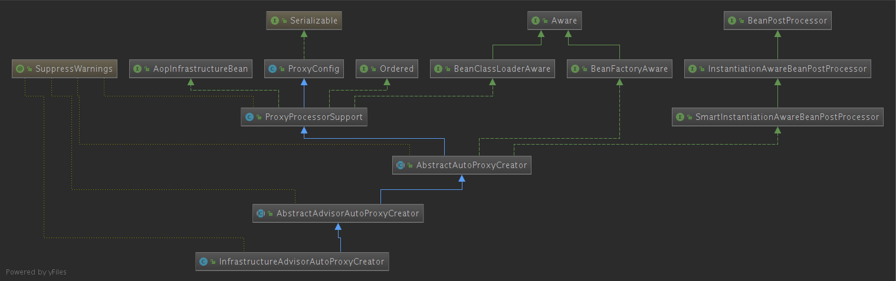
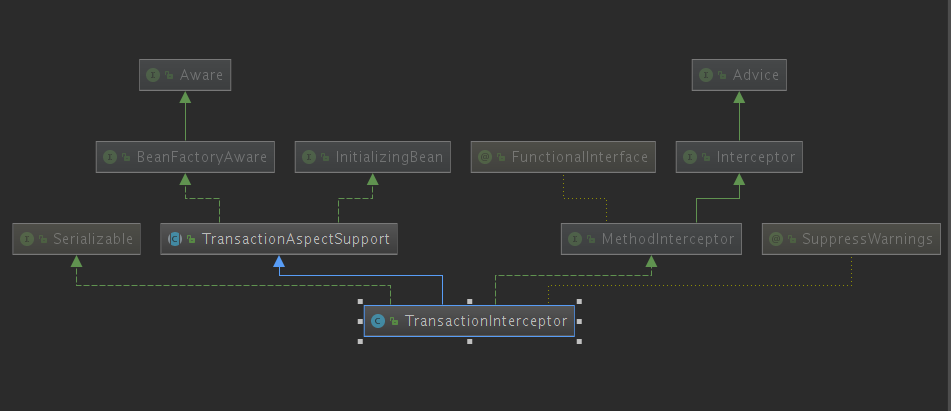

## TX

---

`@EnableTransactionManagement` 开启事务管理器

配置事务管理器控制，并设置控制的数据源

```java
  //配置开启DataSourceTransactionManager
    @Bean
    public DataSourceTransactionManager dataSourceTransactionManager(DataSource dataSource) {
        DataSourceTransactionManager manager = new DataSourceTransactionManager();
        manager.setDataSource(dataSource);
        return manager;
    }
```


`@Transactional` 对标识的方法进行事务控制，当出现异常时回滚操作

`@EnableTransactionManagement` 注解源码

```java
@Target(ElementType.TYPE)
@Retention(RetentionPolicy.RUNTIME)
@Documented
@Import(TransactionManagementConfigurationSelector.class)
public @interface EnableTransactionManagement {
    	boolean proxyTargetClass() default false;
    	AdviceMode mode() default AdviceMode.PROXY;
    	int order() default Ordered.LOWEST_PRECEDENCE;
}
```

`@Import`了一个继承`TransactionManagementConfigurationSelector->AdviceModeImportSelector->ImportSelector`的选择器，重写了`selectImports()`，源码如下：

```java
	/**
	 * Returns {@link ProxyTransactionManagementConfiguration} or
	 * {@code AspectJ(Jta)TransactionManagementConfiguration} for {@code PROXY}
	 * and {@code ASPECTJ} values of {@link EnableTransactionManagement#mode()},
	 * respectively.
	 */
	@Override
	protected String[] selectImports(AdviceMode adviceMode) {
		switch (adviceMode) {
			case PROXY:
				return new String[] {AutoProxyRegistrar.class.getName(),
						ProxyTransactionManagementConfiguration.class.getName()};
			case ASPECTJ:
				return new String[] {determineTransactionAspectClass()};
			default:
				return null;
		}
	}
```

` EnableTransactionManagement`注解中定义了`adviceMode`默认为`AdviceMode.PROXY`,所以这个选择器最后会导入2个组件`AutoProxyRegistrar和ProxyTransactionManagementConfiguration`

`AutoProxyRegistrar`会注册一个自动代理创建器`auto proxy creator`:

```java
/**
	 * Register, escalate, and configure the standard auto proxy creator (APC) against the
	 * given registry. Works by finding the nearest annotation declared on the importing
	 * {@code @Configuration} class that has both {@code mode} and {@code proxyTargetClass}
	 * attributes. If {@code mode} is set to {@code PROXY}, the APC is registered; if
	 * {@code proxyTargetClass} is set to {@code true}, then the APC is forced to use
	 * subclass (CGLIB) proxying.
	 * <p>Several {@code @Enable*} annotations expose both {@code mode} and
	 * {@code proxyTargetClass} attributes. It is important to note that most of these
	 * capabilities end up sharing a {@linkplain AopConfigUtils#AUTO_PROXY_CREATOR_BEAN_NAME
	 * single APC}. For this reason, this implementation doesn't "care" exactly which
	 * annotation it finds -- as long as it exposes the right {@code mode} and
	 * {@code proxyTargetClass} attributes, the APC can be registered and configured all
	 * the same.
	 */
	@Override
	public void registerBeanDefinitions(AnnotationMetadata importingClassMetadata, BeanDefinitionRegistry registry) {
		boolean candidateFound = false;
		Set<String> annoTypes = importingClassMetadata.getAnnotationTypes();
		for (String annoType : annoTypes) {
			AnnotationAttributes candidate = AnnotationConfigUtils.attributesFor(importingClassMetadata, annoType);
			if (candidate == null) {
				continue;
			}
			Object mode = candidate.get("mode");
			Object proxyTargetClass = candidate.get("proxyTargetClass");
			if (mode != null && proxyTargetClass != null && AdviceMode.class == mode.getClass() &&
					Boolean.class == proxyTargetClass.getClass()) {
				candidateFound = true;
				if (mode == AdviceMode.PROXY) {
					AopConfigUtils.registerAutoProxyCreatorIfNecessary(registry);
					if ((Boolean) proxyTargetClass) {
						AopConfigUtils.forceAutoProxyCreatorToUseClassProxying(registry);
						return;
					}
				}
			}
		}
		if (!candidateFound && logger.isInfoEnabled()) {
			String name = getClass().getSimpleName();
			logger.info(String.format("%s was imported but no annotations were found " +
					"having both 'mode' and 'proxyTargetClass' attributes of type " +
					"AdviceMode and boolean respectively. This means that auto proxy " +
					"creator registration and configuration may not have occurred as " +
					"intended, and components may not be proxied as expected. Check to " +
					"ensure that %s has been @Import'ed on the same class where these " +
					"annotations are declared; otherwise remove the import of %s " +
					"altogether.", name, name, name));
		}
	}
```

由`EnableTransactionManagement`的内容可以判断的出这里是会调用`AopConfigUtils.registerAutoProxyCreatorIfNecessary(registry);`方法：

```java
	@Nullable
	public static BeanDefinition registerAutoProxyCreatorIfNecessary(BeanDefinitionRegistry registry) {
		return registerAutoProxyCreatorIfNecessary(registry, null);
	}

	@Nullable
	public static BeanDefinition registerAutoProxyCreatorIfNecessary(BeanDefinitionRegistry registry,
			@Nullable Object source) {

		return registerOrEscalateApcAsRequired(InfrastructureAdvisorAutoProxyCreator.class, registry, source);
	}
	@Nullable
	private static BeanDefinition registerOrEscalateApcAsRequired(Class<?> cls, BeanDefinitionRegistry registry,
			@Nullable Object source) {

		Assert.notNull(registry, "BeanDefinitionRegistry must not be null");

		if (registry.containsBeanDefinition(AUTO_PROXY_CREATOR_BEAN_NAME)) {
			BeanDefinition apcDefinition = registry.getBeanDefinition(AUTO_PROXY_CREATOR_BEAN_NAME);
			if (!cls.getName().equals(apcDefinition.getBeanClassName())) {
				int currentPriority = findPriorityForClass(apcDefinition.getBeanClassName());
				int requiredPriority = findPriorityForClass(cls);
				if (currentPriority < requiredPriority) {
					apcDefinition.setBeanClassName(cls.getName());
				}
			}
			return null;
		}

		RootBeanDefinition beanDefinition = new RootBeanDefinition(cls);
		beanDefinition.setSource(source);
		beanDefinition.getPropertyValues().add("order", Ordered.HIGHEST_PRECEDENCE);
		beanDefinition.setRole(BeanDefinition.ROLE_INFRASTRUCTURE);
		registry.registerBeanDefinition(AUTO_PROXY_CREATOR_BEAN_NAME, beanDefinition);
		return beanDefinition;
	}
```

这里通过调用`registerOrEscalateApcAsRequired(InfrastructureAdvisorAutoProxyCreator.class, registry, source)`方法给容器中注册了一个`InfrastructureAdvisorAutoProxyCreator`。

`InfrastructureAdvisorAutoProxyCreator`与`AOP`中的`AnnotationAwareAspectJAutoProxyCreator`类似，继承了` BeanPostProcessor`接口，都是通过`postProcessAfterInitialization`将增强器包装进代理对象，在代理对象调用方法时通过拦截器链执行方法。



使用`InfrastructureAdvisorAutoProxyCreator`父类`AbstractAutoProxyCreator`的`postProcessAfterInitialization`来包装对象

```java
/**
	 * Create a proxy with the configured interceptors if the bean is
	 * identified as one to proxy by the subclass.
	 * @see #getAdvicesAndAdvisorsForBean
	 */
	@Override
	public Object postProcessAfterInitialization(@Nullable Object bean, String beanName) {
		if (bean != null) {
			Object cacheKey = getCacheKey(bean.getClass(), beanName);
			if (!this.earlyProxyReferences.contains(cacheKey)) {
				return wrapIfNecessary(bean, beanName, cacheKey);
			}
		}
		return bean;
	}
```

` EnableTransactionManagement`注解还会注册一个`ProxyTransactionManagementConfiguration`组件

`ProxyTransactionManagementConfiguration`：

```java
@Configuration
public class ProxyTransactionManagementConfiguration extends AbstractTransactionManagementConfiguration {

	@Bean(name = TransactionManagementConfigUtils.TRANSACTION_ADVISOR_BEAN_NAME)
	@Role(BeanDefinition.ROLE_INFRASTRUCTURE)
	public BeanFactoryTransactionAttributeSourceAdvisor transactionAdvisor() {
		BeanFactoryTransactionAttributeSourceAdvisor advisor = new BeanFactoryTransactionAttributeSourceAdvisor();
		advisor.setTransactionAttributeSource(transactionAttributeSource());
		advisor.setAdvice(transactionInterceptor());
		if (this.enableTx != null) {
			advisor.setOrder(this.enableTx.<Integer>getNumber("order"));
		}
		return advisor;
	}

	@Bean
	@Role(BeanDefinition.ROLE_INFRASTRUCTURE)
	public TransactionAttributeSource transactionAttributeSource() {
		return new AnnotationTransactionAttributeSource();
	}

	@Bean
	@Role(BeanDefinition.ROLE_INFRASTRUCTURE)
	public TransactionInterceptor transactionInterceptor() {
		TransactionInterceptor interceptor = new TransactionInterceptor();
		interceptor.setTransactionAttributeSource(transactionAttributeSource());
		if (this.txManager != null) {
			interceptor.setTransactionManager(this.txManager);
		}
		return interceptor;
	}

}

```

`transactionAttributeSource()`通过注解的形式向容器中注册一个`AnnotationTransactionAttributeSource()`来保存事务的属性信息(通过判断选择使用`SpringTransactionAnnotationParser，JtaTransactionAnnotationParser，Ejb3TransactionAnnotationParser`来分析注解)：

```java
	/**
	 * Create a default AnnotationTransactionAttributeSource, supporting
	 * public methods that carry the {@code Transactional} annotation
	 * or the EJB3 {@link javax.ejb.TransactionAttribute} annotation.
	 */
	public AnnotationTransactionAttributeSource() {
		this(true);
	}

	/**
	 * Create a custom AnnotationTransactionAttributeSource, supporting
	 * public methods that carry the {@code Transactional} annotation
	 * or the EJB3 {@link javax.ejb.TransactionAttribute} annotation.
	 * @param publicMethodsOnly whether to support public methods that carry
	 * the {@code Transactional} annotation only (typically for use
	 * with proxy-based AOP), or protected/private methods as well
	 * (typically used with AspectJ class weaving)
	 */
	public AnnotationTransactionAttributeSource(boolean publicMethodsOnly) {
		this.publicMethodsOnly = publicMethodsOnly;
		if (jta12Present || ejb3Present) {
			this.annotationParsers = new LinkedHashSet<>(4);
			this.annotationParsers.add(new SpringTransactionAnnotationParser());
			if (jta12Present) {
				this.annotationParsers.add(new JtaTransactionAnnotationParser());
			}
			if (ejb3Present) {
				this.annotationParsers.add(new Ejb3TransactionAnnotationParser());
			}
		}
		else {
			this.annotationParsers = Collections.singleton(new SpringTransactionAnnotationParser());
		}
	}
```

`transactionInterceptor()`通过注解的方式向容器中注册是一个事务拦截器`TransactionInterceptor`

`TransactionInterceptor`里保存了事务的属性信息和事务管理器（其本身）。它继承了` MethodInterceptor（方法拦截器）`



当代理对象执行目标方法时，方法拦截器就会开始工作（` MethodInterceptor.invoke`方法调用时）

```java
	@Override
	@Nullable
	public Object invoke(MethodInvocation invocation) throws Throwable {
		// Work out the target class: may be {@code null}.
		// The TransactionAttributeSource should be passed the target class
		// as well as the method, which may be from an interface.
		Class<?> targetClass = (invocation.getThis() != null ? AopUtils.getTargetClass(invocation.getThis()) : null);

		// Adapt to TransactionAspectSupport's invokeWithinTransaction...
		return invokeWithinTransaction(invocation.getMethod(), targetClass, invocation::proceed);
	}
	/**
	 * General delegate for around-advice-based subclasses, delegating to several other template
	 * methods on this class. Able to handle {@link CallbackPreferringPlatformTransactionManager}
	 * as well as regular {@link PlatformTransactionManager} implementations.
	 * @param method the Method being invoked
	 * @param targetClass the target class that we're invoking the method on
	 * @param invocation the callback to use for proceeding with the target invocation
	 * @return the return value of the method, if any
	 * @throws Throwable propagated from the target invocation
	 */
	@Nullable
	protected Object invokeWithinTransaction(Method method, @Nullable Class<?> targetClass,
			final InvocationCallback invocation) throws Throwable {

		// If the transaction attribute is null, the method is non-transactional.
		TransactionAttributeSource tas = getTransactionAttributeSource();
		final TransactionAttribute txAttr = (tas != null ? tas.getTransactionAttribute(method, targetClass) : null);
		final PlatformTransactionManager tm = determineTransactionManager(txAttr);
		final String joinpointIdentification = methodIdentification(method, targetClass, txAttr);

		if (txAttr == null || !(tm instanceof CallbackPreferringPlatformTransactionManager)) {
			// Standard transaction demarcation with getTransaction and commit/rollback calls.
			TransactionInfo txInfo = createTransactionIfNecessary(tm, txAttr, joinpointIdentification);
			Object retVal = null;
			try {
				// This is an around advice: Invoke the next interceptor in the chain.
				// This will normally result in a target object being invoked.
				retVal = invocation.proceedWithInvocation();
			}
			catch (Throwable ex) {
				// target invocation exception
				completeTransactionAfterThrowing(txInfo, ex);
				throw ex;
			}
			finally {
				cleanupTransactionInfo(txInfo);
			}
			commitTransactionAfterReturning(txInfo);
			return retVal;
		}

		else {
			final ThrowableHolder throwableHolder = new ThrowableHolder();

			// It's a CallbackPreferringPlatformTransactionManager: pass a TransactionCallback in.
			try {
				Object result = ((CallbackPreferringPlatformTransactionManager) tm).execute(txAttr, status -> {
					TransactionInfo txInfo = prepareTransactionInfo(tm, txAttr, joinpointIdentification, status);
					try {
						return invocation.proceedWithInvocation();
					}
					catch (Throwable ex) {
						if (txAttr.rollbackOn(ex)) {
							// A RuntimeException: will lead to a rollback.
							if (ex instanceof RuntimeException) {
								throw (RuntimeException) ex;
							}
							else {
								throw new ThrowableHolderException(ex);
							}
						}
						else {
							// A normal return value: will lead to a commit.
							throwableHolder.throwable = ex;
							return null;
						}
					}
					finally {
						cleanupTransactionInfo(txInfo);
					}
				});

				// Check result state: It might indicate a Throwable to rethrow.
				if (throwableHolder.throwable != null) {
					throw throwableHolder.throwable;
				}
				return result;
			}
			catch (ThrowableHolderException ex) {
				throw ex.getCause();
			}
			catch (TransactionSystemException ex2) {
				if (throwableHolder.throwable != null) {
					logger.error("Application exception overridden by commit exception", throwableHolder.throwable);
					ex2.initApplicationException(throwableHolder.throwable);
				}
				throw ex2;
			}
			catch (Throwable ex2) {
				if (throwableHolder.throwable != null) {
					logger.error("Application exception overridden by commit exception", throwableHolder.throwable);
				}
				throw ex2;
			}
		}
	}
```

`nvokeWithinTransaction（）`会需要获取事务的一些信息，比如事务属性信息（之前通过`interceptor.setTransactionAttributeSource(transactionAttributeSource())`设置过），事务管理器（`determineTransactionManager（txAttr）`获取），方法信息（`methodIdentification(method, targetClass, txAttr)`）。

`determineTransactionManager（txAttr）`：

```java
/**
	 * Determine the specific transaction manager to use for the given transaction.
	 */
	@Nullable
	protected PlatformTransactionManager determineTransactionManager(@Nullable TransactionAttribute txAttr) {
		// Do not attempt to lookup tx manager if no tx attributes are set
		if (txAttr == null || this.beanFactory == null) {
			return getTransactionManager();
		}

		String qualifier = txAttr.getQualifier();
		if (StringUtils.hasText(qualifier)) {
			return determineQualifiedTransactionManager(this.beanFactory, qualifier);
		}
		else if (StringUtils.hasText(this.transactionManagerBeanName)) {
			return determineQualifiedTransactionManager(this.beanFactory, this.transactionManagerBeanName);
		}
		else {
			PlatformTransactionManager defaultTransactionManager = getTransactionManager();
			if (defaultTransactionManager == null) {
				defaultTransactionManager = this.transactionManagerCache.get(DEFAULT_TRANSACTION_MANAGER_KEY);
				if (defaultTransactionManager == null) {
					defaultTransactionManager = this.beanFactory.getBean(PlatformTransactionManager.class);
					this.transactionManagerCache.putIfAbsent(
							DEFAULT_TRANSACTION_MANAGER_KEY, defaultTransactionManager);
				}
			}
			return defaultTransactionManager;
		}
	}
```


大致含义就是判断是否有执行的事务管理器，如果没有就从容器中获取（`this.beanFactory.getBean(PlatformTransactionManager.class)`），只要是`PlatformTransactionManager`类型的就行。

获取各种信息后开始准备执行目标方法：

`TransactionInfo txInfo = createTransactionIfNecessary(tm, txAttr, joinpointIdentification);`如果必须的话穿件一个事务信息对象。

`retVal = invocation.proceedWithInvocation();`通过类似`AOP`中拦截器链的方式执行方法，如果有异常会向上抛出。

如果捕获到异常，调用`completeTransactionAfterThrowing(txInfo, ex);`回滚，如果没有调用`commitTransactionAfterReturning(txInfo);`提交操作。

`completeTransactionAfterThrowing(txInfo, ex)`:

```java
/**
	 * Handle a throwable, completing the transaction.
	 * We may commit or roll back, depending on the configuration.
	 * @param txInfo information about the current transaction
	 * @param ex throwable encountered
	 */
	protected void completeTransactionAfterThrowing(@Nullable TransactionInfo txInfo, Throwable ex) {
		if (txInfo != null && txInfo.getTransactionStatus() != null) {
			if (logger.isTraceEnabled()) {
				logger.trace("Completing transaction for [" + txInfo.getJoinpointIdentification() +
						"] after exception: " + ex);
			}
			if (txInfo.transactionAttribute != null && txInfo.transactionAttribute.rollbackOn(ex)) {
				try {
					txInfo.getTransactionManager().rollback(txInfo.getTransactionStatus());
				}
				catch (TransactionSystemException ex2) {
					logger.error("Application exception overridden by rollback exception", ex);
					ex2.initApplicationException(ex);
					throw ex2;
				}
				catch (RuntimeException | Error ex2) {
					logger.error("Application exception overridden by rollback exception", ex);
					throw ex2;
				}
			}
			else {
				// We don't roll back on this exception.
				// Will still roll back if TransactionStatus.isRollbackOnly() is true.
				try {
					txInfo.getTransactionManager().commit(txInfo.getTransactionStatus());
				}
				catch (TransactionSystemException ex2) {
					logger.error("Application exception overridden by commit exception", ex);
					ex2.initApplicationException(ex);
					throw ex2;
				}
				catch (RuntimeException | Error ex2) {
					logger.error("Application exception overridden by commit exception", ex);
					throw ex2;
				}
			}
		}
	}
```

`commitTransactionAfterReturning(txInfo)`:

```
	/**
	 * Execute after successful completion of call, but not after an exception was handled.
	 * Do nothing if we didn't create a transaction.
	 * @param txInfo information about the current transaction
	 */
	protected void commitTransactionAfterReturning(@Nullable TransactionInfo txInfo) {
		if (txInfo != null && txInfo.getTransactionStatus() != null) {
			if (logger.isTraceEnabled()) {
				logger.trace("Completing transaction for [" + txInfo.getJoinpointIdentification() + "]");
			}
			txInfo.getTransactionManager().commit(txInfo.getTransactionStatus());
		}
	}
```

